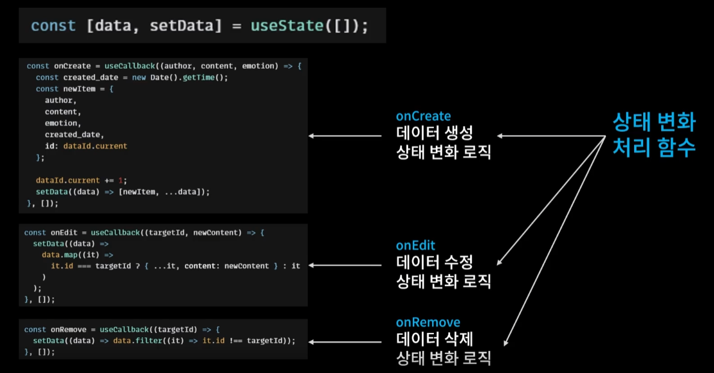

# useReducer

- 복잡한 상태 변화 로직을 앱 컴포넌트에서 독립시키는 기능


---

### 참고 예시



- onCreate, onEdit, onRemove 함수 모두 useState의 data를 사용하기 때문에 컴포넌트 함수 밖으로 빼낼 수 없다.
- 컴포넌트 함수 안에 너무 많은 함수가 나열되어 있는 것은 컴포넌트가 무거워져서 좋지 않다.


---

### 사용법

- 컴포넌트 외부

  ```react
  // import 해서 사용
  import {useReducer} from "React";
  
  // 첫 번째 인자 state : 가장 최신의 state
  // 두 번째 인자 action : dispatch를 호출할 때 전달해 주는 action 객체를 전달 받음
  const reducer = (state, action) => {
    switch (action,type) {
      case 1:
        return state + 1;
      case 10:
        return state + 10;
      case 100:
        return state + 100;
      default:
        return state;
      }
  }
  ```

- 컴포넌트 내부

  ```react
  const Counter = () => {
    
    // [count, dispatch]
    // count : state
    // dispatch : 상태를 변화시키는 action을 발생시키는 함수
    
    // useReducer(reducer, 1)
    // reducer : 함수 외부에 있는 상태를 변화시키는 함수
    // 두번째 인자 1 : count state의 초기값
    const [count, dispatch] = useReducer(reducer, 1);
  
    return (
      <div>
        {count}
        
  <!--
  button을 누르면 dispatch가 실행되면서
  작업을 특정해주는 type property를 필수적으로 포함한 객체를 같이 전달한다.
  
  첫 번째 버튼을 누르면 컴포넌트 외부의 reducer 함수가 실행되는데
  reducer의 첫 번째 인자는 현재의 state값인 1,
  두 번째 인자는 작업을 특정할 type 1이 전달된다.
  해당 작업이 반환하는 return값은 새로운 state가 된다.
  -->
        <button onClick={() => dispatch({ type: 1 })}>add 1</button>
        <button onClick={() => dispatch({ type: 10 })}>add 10</button>
        <button onClick={() => dispatch({ type: 100 })}>add 100</button>
      </div>
    );
  };
  ```

  

---

### 사용 예시

- useState 사용1

  ```react
  const [data, setData] = useState([])
  
  // API를 불러와서 mount 때 data 저장하는 getData함수
  const getData = async () => {
    const res = await fetch(
      "https://jsonplaceholder.typicode.com/comments"
    ).then((res) => res.json());
  
    const initData = res.slice(0, 20).map((it) => {
      return {
        author: it.email,
        content: it.body,
        emotion: Math.floor(Math.random() * 5) + 1,
        created_date: new Date().getTime(),
        id: dataId.current++
      };
    });
    
  	//useState 사용1
    setData(initData);
  };
  
  useEffect(() => {
    getData();
  }, []);

- useReducer 사용1

  ```react
  // 컴포넌트 외부
  const reducer = (state, action) => {
    switch (action.type) {
      case "INIT": {
        return action.data;
      }
        
      default:
        return state;
    }
  };
  
  //컴포넌트 내부
  const [data, dispatch] = useReducer(reducer, []);
  const getData = async () => {
    const res = await fetch(
      "https://jsonplaceholder.typicode.com/comments"
    ).then((res) => res.json());
  
    const initData = res.slice(0, 20).map((it) => {
      return {
        author: it.email,
        content: it.body,
        emotion: Math.floor(Math.random() * 5) + 1,
        created_date: new Date().getTime(),
        id: dataId.current++
      };
    });
  	
    // useReducer 사용1
    dispatch({ type: "INIT", data: initData });
  };
  
  useEffect(() => {
    getData();
  }, []);
  
  ```

  

- useState 사용2

  ```react
  const [data, setData] = useState([])
  
  // 새로운 데이터를 data 리스트에 추가하는 함수 
  const onCreate = useCallback((author, content, emotion) => {
    const created_date = new Date().getTime();
    const newItem = {
      author,
      content,
      emotion,
      created_date,
      id: dataId.current
    };
  
    dataId.current += 1;
    setData((data) => [newItem, ...data]);
  }, []);
  ```

- useReducer 사용2

  ```react
  // 컴포넌트 외부
  const reducer = (state, action) => {
    switch (action.type) {
      case "INIT": {
        return action.data;
      }
      
      // 추가된 부분
      case "CREATE": {
        const created_date = new Date().getTime();
        const newItem = {
          ...action.data,
          created_date
        };
        return [newItem, ...state];
      }
        
      default:
        return state;
    }
  };
  
  // 컴포넌트 내부
  const dataId = useRef(0);
  
  const onCreate = useCallback((author, content, emotion) => {
    dispatch({
      type: "CREATE",
      data: { author, content, emotion, id: dataId.current }
    });
    dataId.current += 1;
  }, []);
  ```

  

- useState 사용3

  ```react
  const [data, setData] = useState([]);
  
  // data리스트에서 특정 id값에 해당하는 녀석을 삭제하는 함수
  const onRemove = useCallback((targetId) => {
    setData((data) => data.filter((it) => it.id !== targetId));
  }, []);
  ```

- useReducer 사용3

  ```react
  // 컴포넌트 외부
  const reducer = (state, action) => {
    switch (action.type) {
      case "INIT": {
        return action.data;
      }
      case "CREATE": {
        const created_date = new Date().getTime();
        const newItem = {
          ...action.data,
          created_date
        };
        return [newItem, ...state];
      }
        
      // 추가된 부분
      case "REMOVE": {
        return state.filter((it) => it.id !== action.targetId);
      }
        
      default:
        return state;
    }
  };
  
  // 컴포넌트 내부
  const onRemove = useCallback((targetId) => {
      dispatch({ type: "REMOVE", targetId });
    }, []);
  ```

  

- useState 사용4

  ```react
  const [data, setData] = useState([]);
  
  // data 리스트의 특정 id값에 해당하는 녀석을 수정하는 함수
  const onEdit = useCallback((targetId, newContent) => {
    setData((data) =>
      data.map((it) =>
        it.id === targetId ? { ...it, content: newContent } : it
      )
    );
  }, []);
  ```

- useReducer 사용4

  ```react
  // 컴포넌트 외부
  const reducer = (state, action) => {
    switch (action.type) {
      case "INIT": {
        return action.data;
      }
      case "CREATE": {
        const created_date = new Date().getTime();
        const newItem = {
          ...action.data,
          created_date
        };
        return [newItem, ...state];
      }
      case "REMOVE": {
        return state.filter((it) => it.id !== action.targetId);
      }
        
      // 추가된 부분
      case "EDIT": {
        return state.map((it) =>
          it.id === action.targetId
            ? {
                ...it,
                content: action.newContent
              }
            : it
        );
      }
        
      default:
        return state;
    }
  };
  
  // 컴포넌트 내부
  const onEdit = useCallback((targetId, newContent) => {
    dispatch({
      type: "EDIT",
      targetId,
      newContent
    });
  }, []);
  ```

  